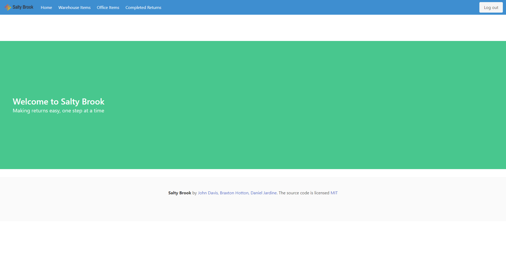
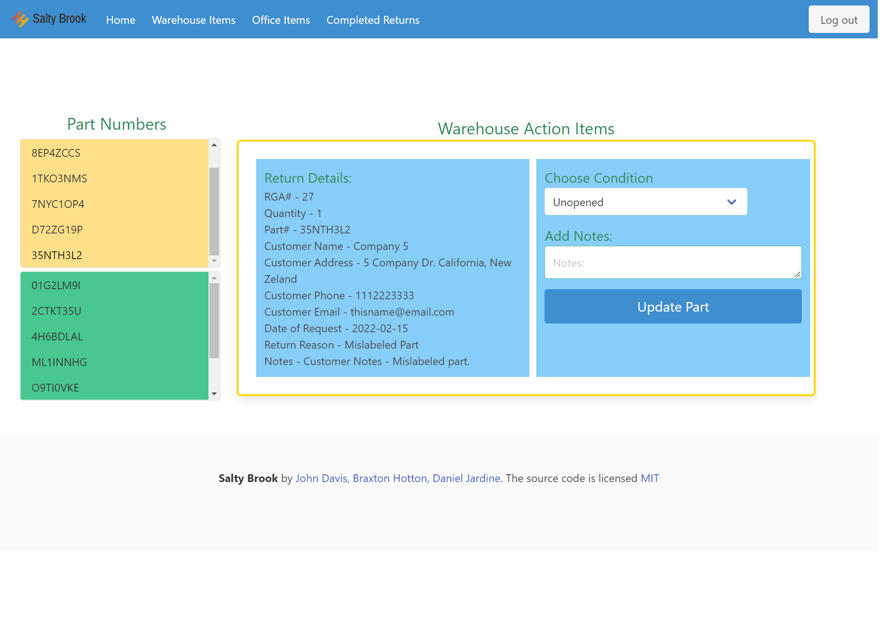
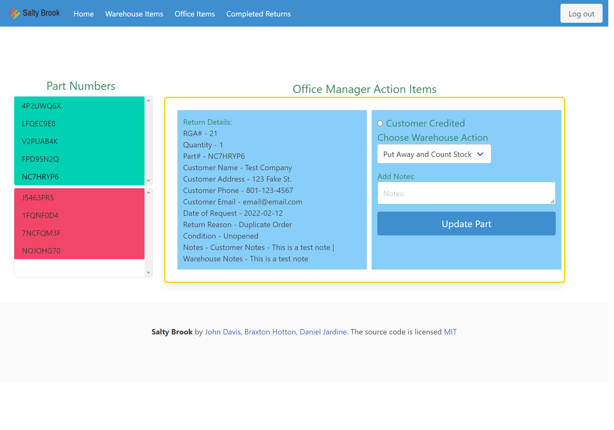
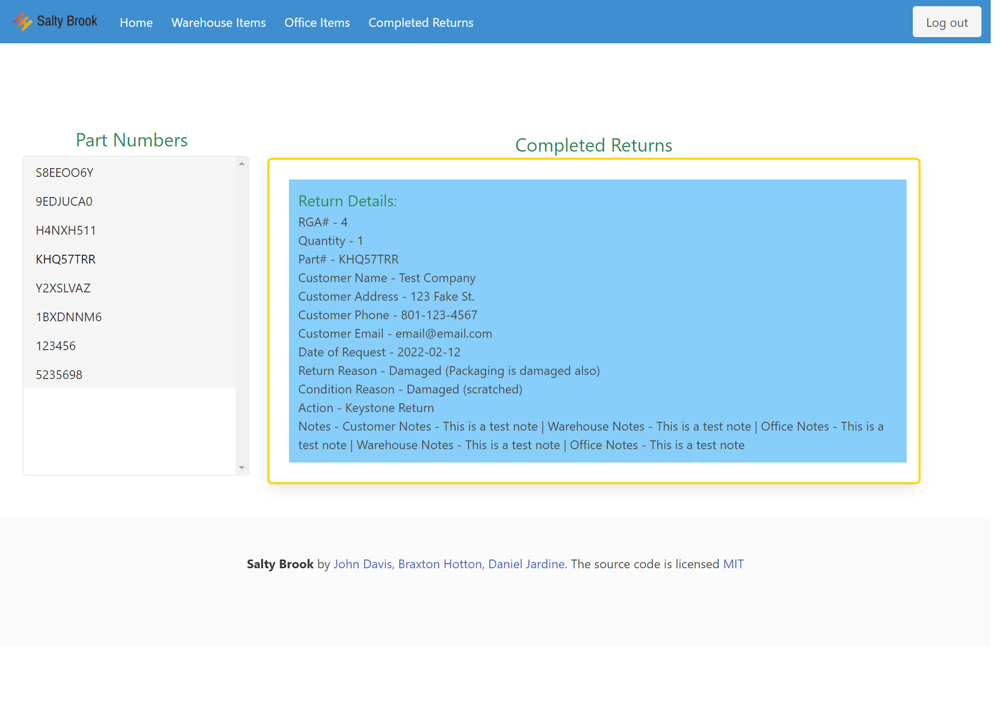

  # Salty Brook

  

  ### Description 

  This project was started to help alliviate some of the hedaches of processing returns for Davis Distributing Co, a wholesale warehouse that has been in John's family for over 65 years. As a B2B wholesaler of truck equipment, we sell lots of products to repeat reselling customers. Anytime they need to return a product they purchased, it is a headache for everyone involved. Right now its about 4 times the amount of work versus selling them the product but we don't make any money on this work. This app is designed to be a simple, linear step by step style process to help everyone involved, the customer, the warehouse people physically handling the products and the office manager tasked with the paperwork side of things. 

  This app uses lots of different technologies including: HTML, Bulma, CSS, JS, Handlebars.js, Express.js, Heroku, Sequelize.js, MySQL Database.

  ## Table of Contents

  * [Installation](#installation)
  * [Usage](#usage)
  * [Credits](#credits)
  * [License](#license)
  * [Contributing](#contributing)
  * [Questions](#questions)

  ### Installation

  [Heroku Deployed Link](https://salty-brook-34116.herokuapp.com/)

  [Customer Return Request Deployed Link](https://salty-brook-34116.herokuapp.com/request)

  ### Usage 

  This was built for Davis Distributing Co as a custome application, but the backbones are built to use this code for another linear step by step process for many types of tasks and other companies.

  See the following images for a preview!
  
  
  
  

  ### Credits
  
  Module 14 coursework and help from our awesome TA's!

  ### License

  

  Permission is hereby granted, free of charge, to any person obtaining a copy of this software and associated documentation files (the "Software"), to deal in the Software without restriction, including without limitation the rights to use, copy, modify, merge, publish, distribute, sublicense, and/or sell copies of the Software, and to permit persons to whom the Software is furnished to do so, subject to the following conditions:

  The above copyright notice and this permission notice shall be included in all copies or substantial portions of the Software.

  THE SOFTWARE IS PROVIDED "AS IS", WITHOUT WARRANTY OF ANY KIND, EXPRESS OR IMPLIED, INCLUDING BUT NOT LIMITED TO THE WARRANTIES OF MERCHANTABILITY, FITNESS FOR A PARTICULAR PURPOSE AND NONINFRINGEMENT. IN NO EVENT SHALL THE AUTHORS OR COPYRIGHT HOLDERS BE LIABLE FOR ANY CLAIM, DAMAGES OR OTHER LIABILITY, WHETHER IN AN ACTION OF CONTRACT, TORT OR OTHERWISE, ARISING FROM, OUT OF OR IN CONNECTION WITH THE SOFTWARE OR THE USE OR OTHER DEALINGS IN THE SOFTWARE.
  
  ### Contributing

  Braxton Hotton, John Davis, Daniel Jardine

  ### Questions?

  [Braxton Hotton's Github](https://github.com/HottieHotton)

  [Braxton's Email](mailto:bhotton25@gmail.com)

  [John Davis's Github](https://github.com/johndavis92790/)

  [John's Email](mailto:johndavis92790@gmail.com)

  [Daniel Jardine's Github](https://github.com/danieljardine04)

  [Daniel's Email](mailto:danogaryjardine@gmail.com)
